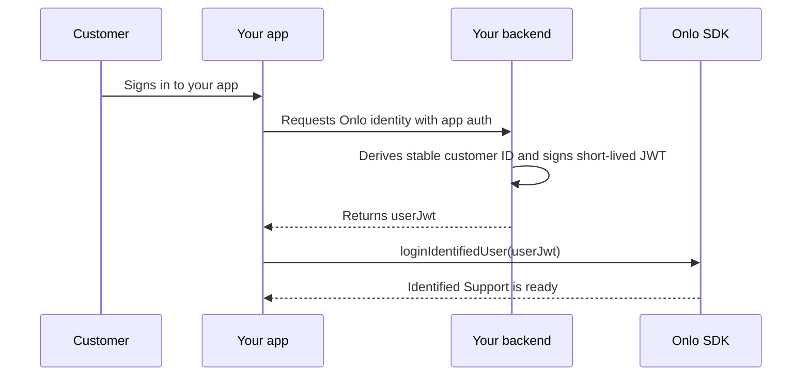

# Onlo Mobile SDKs

Add Onlo’s native support messenger to an iOS, Android, React Native, or Flutter app. Every SDK follows the same flow: **install → initialize → choose a login mode → present → logout**.

## Choose your SDK

| Your app | Start here | Package |
| --- | --- | --- |
| iOS (SwiftUI or UIKit) | [iOS step-by-step guide](packages/ios/README.md) | `OnloSDK` `0.3.0` |
| Android (Kotlin) | [Android step-by-step guide](packages/android/README.md) | `ai.onlo:onlo-android-sdk:0.3.0` |
| React Native | [React Native step-by-step guide](packages/react-native/README.md) | `@onlo-ai/react-native@0.3.0` |
| Flutter | [Flutter step-by-step guide](packages/flutter/README.md) | `onlo_flutter 0.3.0` |

React Native and Flutter display the same native messenger as the iOS and Android SDKs. Do not add a native SDK separately when using a framework package.

## Prerequisites

- [ ] Create or select a Mobile SDK integration in Onlo Dashboard.
- [ ] Copy its public SDK key. This key may be included in the app; it is not a secret.
- [ ] Decide whether customers will use support anonymously, as signed-in users, or both.
- [ ] For signed-in users, add an authenticated endpoint to your backend that returns a fresh Onlo user JWT.
- [ ] Choose a screen or button in your app that will open Support. Onlo does not add a launcher automatically.

## Concepts

| Value | Created by | Used by | Storage rule |
| --- | --- | --- | --- |
| Public SDK key | Onlo Dashboard | App calls `initialize` | Safe in app configuration; never use it as customer identity |
| User JWT | Your authenticated backend | App calls `loginIdentifiedUser` | Pass directly to the SDK; never create, decode, log, or persist it in the app |
| Signing secret | Onlo Dashboard / your backend configuration | Your backend signs the user JWT | Server-only; never ship it in an app, repository, or build setting |

There is no Onlo OTP or second customer login. Your app authenticates the customer once; your backend then proves that identity to Onlo.

## Integration steps

1. Open the guide for your platform and install its package.

   Expected result: the Onlo import resolves and the host app builds.

2. Initialize Onlo once with the public SDK key.

   ```text
   initialize(public SDK key)
   ```

   Expected result: the SDK restores or creates protected native session state without presenting UI or requesting permissions.

3. Choose one login path for the current customer.

   | Customer state | App action |
   | --- | --- |
   | Not signed in | Call `loginUnidentifiedUser()` |
   | Signed in | Fetch a fresh JWT from your backend, then call `loginIdentifiedUser(...)` |

   Expected result: Support is ready for the correct anonymous installation or verified customer.

4. Add a host-owned Support button and call `present()` from its tap handler.

   Expected result: the native Onlo messenger opens only when your app requests it.

5. When your customer signs out or switches accounts, disable Support and await `logout()` before enabling it for the next customer.

   Expected result: the previous customer’s messages, queued sends, unread state, and push association are inaccessible before another customer can use Onlo.

6. After the basic chat flow works, configure optional push, images, voice, unread badges, and deep-link routing from the platform guide.

   Expected result: each optional feature is added independently without changing the login flow.

## How identified login works



The JWT must use the customer’s stable, opaque ID as `sub`; do not use a mutable email address or phone number as the primary identity. The exact claim rules are in the [API contract](docs/api-contract.md#operator-user-jwt).

## What the SDK handles

| Your app controls | Onlo SDK controls |
| --- | --- |
| Public SDK key selection | Protected credential storage |
| Anonymous or identified login choice | Session restoration and token refresh |
| Backend JWT request | Durable offline outbox and retries |
| Where and when Support opens | Native messenger UI and configuration |
| Account logout ordering | Transcript, unread, media, and push ownership boundaries |

## Success criteria

- The app builds with exactly one Onlo package/native core per platform.
- Anonymous or identified login completes without blocking the rest of the app.
- The messenger opens from a button or route owned by the host app.
- No signing secret, user JWT, chat token, message text, or attachment URL is stored or logged by the host.
- Logout finishes, or remains safely pending with Support disabled, before another customer uses Onlo.

## Troubleshooting

| Symptom | Likely cause | Fix |
| --- | --- | --- |
| The package imports but Support never becomes ready | Initialization or login did not complete | Check the public SDK key and inspect only the SDK’s safe error code |
| Identified login fails | The backend returned an expired or invalid JWT | Request a new JWT; verify `HS256`, `aud: onlo-messenger`, stable `sub`, and a lifetime of at most five minutes |
| A second customer sees stale Support state | Account switching did not await Onlo logout | Disable Support before host logout and do not enable it for the next account until Onlo logout completes |
| React Native or Flutter has duplicate native symbols | A native core was added manually beside the wrapper | Remove the extra native dependency; the framework package already resolves it |
| Push works in a simulator-only test but not on a device | Provider setup is incomplete | Follow the platform push steps and validate APNs/FCM delivery on a real supported device |

## For contributors

This repository also contains the protocol contract, native cores, framework bridges, examples, and conformance fixtures. Start with [CONTRIBUTING.md](CONTRIBUTING.md), then read the [development and go-live guide](docs/development-and-go-live-guide.md).

| Path | Purpose |
| --- | --- |
| `packages/ios`, `packages/android` | Native SDKs that own session, secure storage, outbox, lifecycle, push, permissions, and UI |
| `packages/react-native`, `packages/flutter` | Thin typed bridges over the native SDKs |
| `examples` | Runnable host integrations with safe placeholder configuration |
| `contracts/v1`, `packages/protocol` | Canonical language-neutral fixtures and shared protocol types |
| `conformance` | Cross-SDK lifecycle and protocol scenarios |
| `sdk/react-native` | Legacy prototype reference only; never use it as a production fallback |

## Related documentation

- [Complete mobile integration guide](docs/integration-guide.md)
- [API contract](docs/api-contract.md)
- [Architecture](docs/architecture.md)
- [Development and go-live guide](docs/development-and-go-live-guide.md)

Next: choose your platform guide and complete the basic chat flow before adding optional features.
