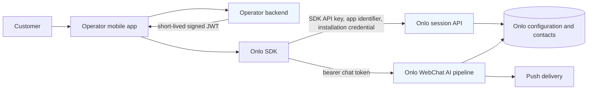
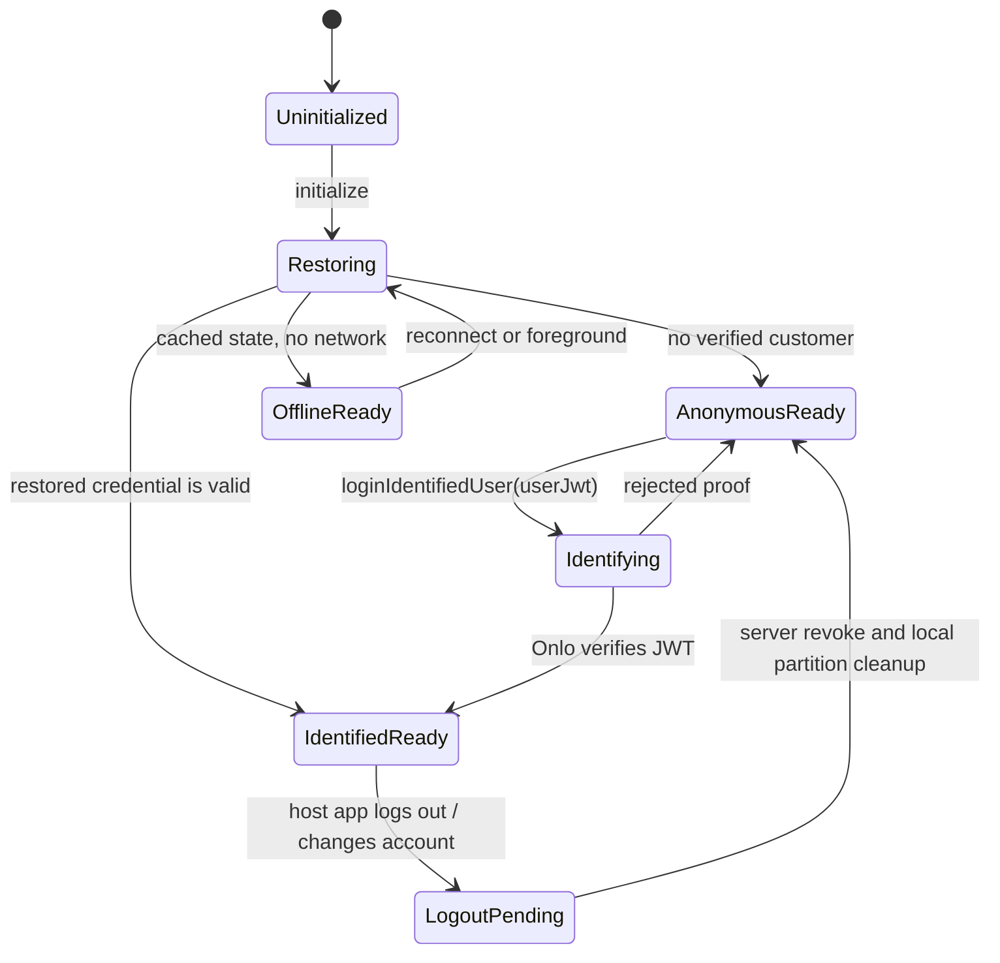

# Mobile SDK architecture

The mobile SDK is an extension of WebChat, not a new AI product. It uses the same Onlo organisation, settings, conversation store, WebChat AI pipeline, escalation behavior, and streaming token path. Native-only responsibilities live on the device.

## Components

| Component | Responsibility | Does not do |
| --- | --- | --- |
| Operator mobile app | Owns its customer login and chooses where support opens. | Sign Onlo JWTs in the app or expose its signing secret. |
| Operator backend | Verifies its logged-in customer, creates short-lived Onlo JWTs. | Render chat or store Onlo session credentials. |
| Onlo SDK | Native messenger UI, secure local state, durable outbox, config refresh, foreground stream, permission timing. | Decide whether a customer belongs to the Operator without server proof. |
| Onlo mobile session API | Validates SDK key/app identity and exchanges credentials/JWTs. | Run a separate AI pipeline. |
| WebChat pipeline | Creates/continues conversations, streams AI, escalates, and stores messages. | Depend on a browser DOM for mobile sessions. |

## Trust boundaries

The SDK API key proves only which Operator configuration the app requests. It is expected to be present in an app binary and is not a customer credential. The customer JWT proves the Operator backend has authenticated a particular customer. The rotating installation credential binds safe local continuity to the device; the short-lived chat token authorises ordinary calls after bootstrap.

## Lifecycle

The local database is partitioned by anonymous installation generation or verified contact scope. On logout, identified messages, read state, pending user-bound work, and credentials become inaccessible before another app account may use the messenger.

## Configuration behavior

`GET /api/sdk/v1/config` is bearer-authenticated and uses schema `1`, optional `If-None-Match`, and `ETag`/`304` conditional refresh. The v1 `MobileConfig` projection defines compatible appearance, features, content, security policy, and unsupported settings; unknown additive fields are ignored. Keep the last-known-good config offline, refresh on `config_changed`, foreground, and network recovery, and follow the envelope retry directive. The Operator’s host app controls messenger placement.

## Failure modes

| Failure | SDK behavior | Customer-facing result |
| --- | --- | --- |
| No network | Render local conversations; queue new messages durably; retain last-known-good config. | A clear pending state, no lost send. |
| App kill or reboot | Restore credential, outbox, and bounded transcript sync. | Pending messages retain one ID and do not duplicate. |
| Chat token expiry | Refresh through the session endpoint. | Conversation continues without a second login when possible. |
| JWT rejected/expired | Keep anonymous scope; ask host code for a fresh JWT. | No leaked identified history. |
| Account switch | Revoke/unlink, hide old scope, clear sensitive local state, then optionally bootstrap anonymous. | The next person cannot see the previous person’s conversation. |
| Push missed or delayed | Treat push as a hint and sync when foregrounded. | Correct current transcript rather than stale notification content. |
| Settings change while offline | Retain last-known-good config and conditionally refresh on recovery. | No unsupported cache behavior. |
