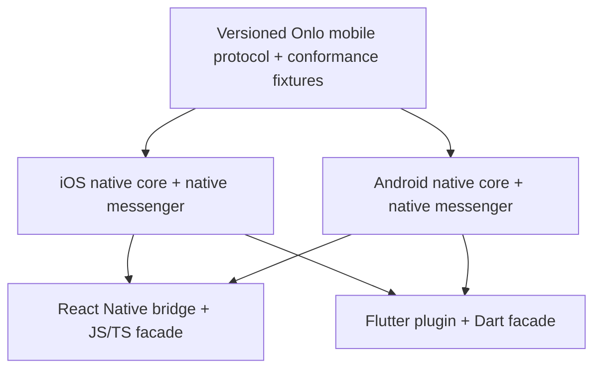
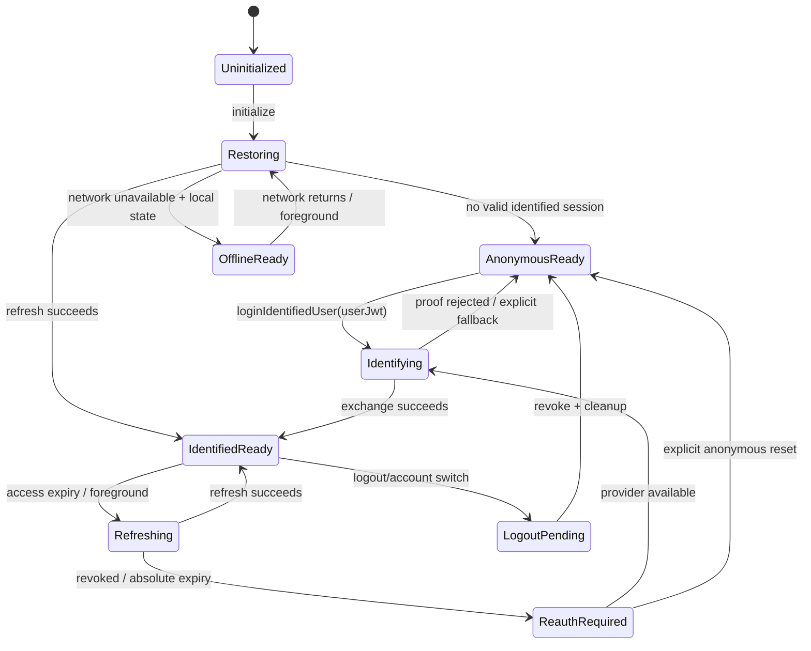

# Mobile SDK — Four-Client Delivery Plan

**Status:** Proposed; follows the approved Onlo mobile SDK product model.
**Scope:** Native iOS, native Android, React Native, Flutter, shared protocol fixtures, messenger UI, lifecycle, local persistence, push, media, release artifacts, and customer-facing integration docs.
**Server dependency:** the committed mobile SDK server control plane in the Onlo server repository; its public release remains a deployment gate.

The four customer-facing integrations are two native products plus two thin framework bridges:



React Native and Flutter do not implement another auth state machine, outbox, stream, push registry, or chat UI. They expose the corresponding native core on the runtime OS.

## 0. Non-negotiable client rules

- The public install key identifies the Operator's mobile WebChat configuration. It is expected in the binary and is not a user secret, identity proof, or app-authenticity proof.
- No Operator signing secret is ever shipped in an app, JavaScript bundle, Dart bundle, sample, or dashboard mobile snippet.
- `loginIdentifiedUser` accepts one short-lived HS256 `userJwt` minted by the Operator backend after authenticating its own app session. It uses `aud` `onlo-messenger`, required opaque `sub`, numeric `iat`/`exp` with a maximum five-minute lifetime, and only the documented optional profile/custom-attribute claims.
- The SDK never signs or persists the user JWT because the Messenger secret never reaches the device. The proof is held only for exchange; the rotating installation credential uses native protected storage.
- Unsigned email/phone attributes are never treated as history keys. If the Operator deliberately chooses email or phone as the signed identifier, Onlo treats that exact value as the opaque key. Clients never choose a contact ID or organization ID.
- All outgoing turns enter a durable structured outbox before network send and retain one client message ID across every retry.
- Push and SSE are delivery hints. Bounded durable transcript refetch is the initial convergence mechanism; an event cursor is introduced only when measured scale requires it.
- Starting a new conversation does not rotate the installation/anonymous identity.
- Logout is a server revoke/unlink operation first, local credential cleanup second, completion callback last.
- Native permission prompts are just-in-time after a customer action. SDK initialization never asks for notification, camera, microphone, or photo access.
- Browser URL/page targeting does not execute on native screens. The host app controls where it calls `present()`.
- Production uses `https://onlo.ai`; staging/review receives an exact HTTPS origin from release configuration, never a guessed hostname. Local overrides are development-only.
- Client capabilities are limited to the values declared by the v1 manifest: `secure_storage`, `persistent_outbox`, `foreground_stream`, `apns`, `fcm`, `media_picker`, `attachment_upload`, `config_schema_v1`, `identity_jwt`, `app_attestation`, and `deep_link_routing`.
- Mobile SDK logs never contain proofs, credentials, message text, email, phone, push tokens, or attachment URLs.
- Package/version/size/performance/OS-support claims remain unpublished until measured from release artifacts.

## 1. Customer integration mental model

The Operator app already owns customer login. There is no second Onlo login.

```mermaid
sequenceDiagram
    actor Customer
    participant Host as Operator app
    participant HostAPI as Operator backend / approved IdP
    participant SDK as Onlo native core
    participant Onlo as Onlo server

    Host->>SDK: initialize({ sdkKey })
    SDK->>Onlo: anonymous exchange + transcript sync
    Customer->>Host: logs in to the Operator account
    Host->>HostAPI: request Onlo user JWT using existing login
    HostAPI->>HostAPI: derive stable user ID; sign short-lived JWT
    HostAPI-->>Host: server-approved userJwt
    Host->>SDK: loginIdentifiedUser({ userJwt })
    SDK->>Onlo: exchange identity + app/installation evidence
    Onlo-->>SDK: verified contact session + history
    SDK->>Onlo: sync verified history
    Customer->>SDK: opens Support and chats
```

The Operator builds and controls the host app. If the app does not call `loginIdentifiedUser()`, the SDK remains anonymous—but the public install key still lets Onlo derive and record the correct Operator, publication state, SDK family/version, runtime platform, and installation. Mobile does not expose a WebChat identity toggle, OTP, or second-login flow.

## 2. Target public API

The API names below are the recommended contract. Platform idioms may vary, but capabilities and state transitions must remain equivalent.

### 2.1 Initialization

Initialization is synchronous/local where possible and starts asynchronous bootstrap in the background.

```text
initialize({ sdkKey })
```

Behavior:

- validates key shape and singleton configuration;
- loads/generates the installation ID;
- restores protected session credential and local last-known-good state;
- reports SDK family/version, runtime OS, protocol, and capabilities;
- obtains app-attestation evidence when policy/capability requires it;
- exchanges or refreshes an anonymous/existing session;
- conditionally refreshes config and performs bounded transcript refetch;
- does not show UI, ask permissions, or declare the user identified.

Each client receives the public install key created for that SDK integration. React Native and Flutter report their runtime OS separately:

```ts
Onlo.initialize({
  sdkKey: 'onlo_rn_sk_…',
});
```

The key resolves the Operator; SDK family and runtime OS remain separate metadata. The key does not identify an SDK version or end customer.

### 2.2 Identity

Primary contract:

```text
loginIdentifiedUser({ userJwt })
```

The Operator backend derives mobile identity from its authenticated app session and signs an HS256 user JWT with `aud` `onlo-messenger`, opaque required `sub`, numeric `iat`/`exp`, and a maximum five-minute lifetime. Optional `name`, `email`, `phone`, `locale`, and bounded `customAttributes` use the exact limits in the canonical API contract. The SDK does not ask the customer to log into Onlo.

Required behavior:

- [ ] Validate only basic compact-JWT shape locally for fast feedback; never treat client decoding as verification.
- [ ] A missing/expired/invalid JWT or backend failure has a typed state and retry path. Decoded-but-unverified claims never become weaker identity.
- [ ] If the server reports identity mode disabled or policy-revoked, immediately hide/partition identified cached state, unlink the identified UI session, and continue anonymously only after the server confirms the anonymous scope.
- [ ] Forward only the documented optional profile/custom-attribute claims; decoded-but-unverified attributes never independently authorize history.
- [ ] On success, anonymous promotion and verified history come from the server result.
- [ ] On identity change, old session/push association is revoked before a new exchange.
- [ ] Host app obtains a fresh short-lived JWT and calls identify after process launch when it restores its own authenticated session.

Framework-idiomatic shape:

| Client | Identified-login call |
|---|---|
| iOS / Swift | `try await OnloSDK.loginIdentifiedUser(userJwt: token)` |
| Android / Kotlin | `Onlo.loginIdentifiedUser(userJwt = token)` |
| React Native / TypeScript | `await Onlo.loginIdentifiedUser({ userJwt: token })` |
| Flutter / Dart | `await Onlo.loginIdentifiedUser(userJwt: token)` |

All four calls mean the same thing: the server verifies the Operator-backend HS256 signature and documented claims before associating the session with customer identity.

There are no mobile provider-specific login methods and no mobile OTP method. Do not expose raw contact IDs or organization IDs. Email/phone are valid identifier values only when the Operator intentionally selects them and the backend signs the same value; an unsigned email/phone field is never sufficient proof.

### 2.3 Logout

```text
await logout()
```

Order:

1. stop accepting sends under the old contact/installation generation;
2. ask Onlo server to revoke the session and unlink push;
3. if temporarily offline, durably mark `logoutPending`, block old history/UI, discard any in-memory user JWT, and retry revocation without re-exposing the old account;
4. clear access/session credentials, verified-history cache, read state, and old-contact outbox according to policy;
5. create/restore a fresh anonymous installation session if the host continues running;
6. complete so the host can finish its own logout.

The installation ID can remain for anonymous installation continuity, but no prior identified content may remain renderable to the next account.

### 2.4 UI and state

First release:

```text
present(optional conversationId)
dismiss()
openConversation(id)
observeConnectionState(callback/stream)
observeIdentityState(callback/stream)
```

Identified sessions expose the server's customer-facing
`totalUnreadCount` and per-conversation `unreadCount`. The SDK acknowledges only
through the latest successfully rendered message, then refetches the list.
Anonymous sessions expose no persistent unread badge.

- The host owns the entry point: tab, menu row, button, or routing action.
- Onlo owns the presented messenger screen and its accessibility behavior.
- `present()` works for anonymous users unless Operator policy requires verification.
- Deep links validate conversation ownership after sync; a push payload cannot force-open an unauthorized ID.
- A headless transcript/composer API is not in first release.
- A global floating launcher is not installed automatically. Framework helper buttons may be added later as ordinary host components, not window overlays.

### 2.5 Push

```text
setPushToken(APNs/FCM token)
handlePushNotification(payload) -> handled/deferred/notOnlo
```

- Host app owns OS permission timing and receives native callbacks.
- SDK fingerprints/queues token registration against the current installation/session.
- Token rotation is idempotent.
- Push tap routes to Onlo only after payload signature/shape, target, session, and conversation ownership are checked.
- Notification content is a preview. Opening always syncs from the server.

## 3. Shared client state machine

Every native core implements the same externally observable state model.



State is split, not collapsed into one “connected” boolean:

- bootstrap/config readiness;
- customer scope class (anonymous installation or verified contact);
- access/session validity;
- network transport state;
- sync freshness/cursor state;
- foreground stream state;
- outbox state;
- push registration state.

The UI derives user-visible status from these dimensions and never guesses identity from cached profile fields.

## 4. Local persistence and offline contract

### 4.1 Storage classes

| Data | Persistence | Security / lifecycle |
|---|---|---|
| Installation ID | Durable native local preference/store | Pseudonymous; reset on reinstall/explicit anonymous reset |
| Rotating session credential | iOS Keychain / Android Keystore-backed protected store | Never in AsyncStorage, JS, Dart, logs, or ordinary database |
| Access token | Memory by default | Short-lived; reacquire after process death |
| User ID + user hash | Memory/host-auth session only | Clear on logout; obtain again from Operator backend when re-verification is required |
| Conversations/messages | Structured SQLite-backed local store | Partition by owner scope; identified content becomes inaccessible immediately on logout |
| Outbox | Same transactional local database | Survives process death/reboot; structured state, no plain string array |
| Config | Last-known-good projection + revision/schema | Replace atomically only after validation |
| Last-refetch/read position | Transactional local database | Scoped to installation generation/contact session owner |
| Push token registration intent | Protected/sensitive local state | Reconcile after token/session/network change |

### 4.2 Outbox row

Each outgoing message is inserted before network work with at least:

- `clientMessageId` UUID;
- owner scope and local conversation/server conversation IDs;
- content/attachment intent references;
- created timestamp and stable client ordering key;
- state: `queued`, `sending`, `accepted`, `failed_retryable`, `failed_terminal`, `cancelled`;
- attempt count, next-attempt time, last typed error;
- server message ID and AI run ID after acknowledgement.

Rules:

- [ ] Retrying always reuses `clientMessageId` and identical logical payload.
- [ ] Process death while `sending` returns the row to a reconcilable state; it does not mint a new ID.
- [ ] No silent oldest-message eviction. Capacity pressure produces visible backpressure/error and preserves already accepted data.
- [ ] Per-conversation ordering is maintained; unrelated conversations may progress independently.
- [ ] Attachment upload completion is a prerequisite state, not an in-memory callback.
- [ ] Terminal auth errors stop the relevant owner queue until re-authenticated; they do not send as anonymous.
- [ ] Logout/account switch prevents an old-owner outbox from sending under a new contact/installation generation.

### 4.3 Reconciliation order

On initialization, foreground, network recovery, push tap, and stream gap:

1. restore local protected/session state;
2. obtain/refresh valid access for the expected contact/installation generation;
3. conditional config fetch;
4. sync server changes from cursor;
5. reconcile ambiguous outbox receipts by client message ID;
6. send eligible queued messages with bounded exponential backoff and jitter;
7. attach foreground SSE with cursor/event resume information;
8. update customer read state only when content is actually presented.

## 5. Configuration and theme behavior

The client must not download CSS. `GET /api/sdk/v1/config` is bearer-authenticated and uses schema `1`, `ETag`, optional `If-None-Match`, and empty `304` responses for conditional refresh. The v1 `MobileConfig` projection is authoritative for native configuration.

Required settings contract:

- config `revision` and `schemaVersion`;
- minimum/maximum schema compatibility;
- color/design tokens with accessible contrast fallback;
- logo/avatar assets with versioned/cacheable URLs and safe fallback;
- bot/display name, welcome copy, locale strings, pre-chat fields, attachment capability, conversation/ticket behavior;
- explicit unsupported/browser-only fields;
- server minimum-version/security override metadata.

On `config_unavailable`, retain last-known-good config and follow `after_backoff`; `incompatible_client` is not retried. More generally, the v1 envelope directives are `never`, `after_token_refresh`, `after_attestation`, `after_backoff`, and `after_full_sync`, each with the action defined in the API contract.

Refresh triggers:

- initialization/session exchange;
- messenger presentation;
- app foreground;
- network recovery;
- foreground `config_changed` hint;
- periodic conditional refresh with bounded interval.

Version outcome:

- App 1.0 and 2.0 can receive the same published canonical revision but different compatible projections.
- Unknown additive fields are ignored.
- Missing/new required behavior receives a server projection/default or typed unsupported result.
- A corrupt/incompatible/offline fetch keeps last-known-good config.
- Active app changes soon after the event/refetch; suspended/terminated/offline app changes on next lifecycle recovery.
- A security minimum version may disable identified/history behavior server-side; a color/content change never forces an app upgrade.

## 6. Foreground realtime, background push, and lifecycle

| App state | Primary mechanism | Required recovery |
|---|---|---|
| Messenger visible, network healthy | SSE/stream + local database rendering | Apply events idempotently; bounded transcript refetch on gap/error |
| Foreground, messenger hidden | Stream may remain for bounded period or disconnect by policy | Push/local unread hint; sync before next display |
| Background | APNs/FCM best effort | Persist notification routing intent; sync on resume/tap |
| Terminated | APNs/FCM may display through OS | Cold initialize, validate route, refresh session, sync, then present |
| Offline/network switch | Local last-known-good transcript/outbox | Backoff + network callback; sync before stream |
| Device reboot | Durable OS notification + local database/credential storage | Normal cold-start reconciliation |

- Native lifecycle observers, not JS timers, drive session refresh and reconnect.
- Stream reconnect uses bounded exponential backoff with jitter and a network/lifecycle gate.
- The SDK tolerates duplicate, reordered, and missed SSE/push events by applying stable server IDs and then syncing.
- OS background execution is opportunistic. The guide must not promise guaranteed background socket execution.

## 7. Native messenger UI

One behavior specification applies to UIKit/SwiftUI and Compose/Views hosts:

- open on the widget-parity Home surface, never directly in a prior thread;
- operator-branded header with presence subtitle, refresh, close, and stack-aware back navigation;
- identified greeting while the accepted JWT name remains in memory, with a generic greeting after process restoration;
- up to three recent conversations with relative timestamps and an explicit all-conversations view;
- up to three FAQ quick questions, with Browse all routing to Help Center and retaining its explicit empty state when no articles are published;
- conversation list/history when enabled;
- conversation detail with customer/AI/operator/ticket states;
- end-user (`role=user`) bubbles align right and use `outgoing`/`outgoingText`; every non-end-user bubble aligns left and uses `incoming`/`incomingText`;
- composer with deterministic queued/sending/failed/accepted status;
- retry/cancel affordances for terminal/retryable failures;
- typing/streaming with persisted-message reconciliation;
- offline and stale-content banner that does not hide usable cached history;
- unread badge based on customer read state, excluding own sends;
- pre-chat surfaces only when supported by mobile policy; no Onlo OTP or second-login surface;
- media picker/upload progress and recoverable permission denial;
- accessibility labels, focus order, dynamic text, screen-reader announcements, reduced motion, color contrast, keyboard/insets, RTL, and localization;
- dark/light/system appearance using projected `accent`, `background`, `outgoing`, `outgoingText`, `incoming`, and `incomingText` tokens;
- composer and Powered by Onlo footer remain anchored below Home, lists, articles, and threads;
- an answered FAQ renders directly; an unanswered quick question starts the normal durable chat flow;
- no browser DOM actions or auto-open-on-scroll/exit behavior.

The host can present full-screen or embed the native controller/activity destination using supported platform navigation hooks. First release does not expose raw internal view models as a headless UI kit.

## 8. Media and permission behavior

- Use the system photo picker where available so broad library permission is avoided.
- Request camera permission only after the customer taps Camera.
- Request microphone only if/when voice-note recording is actually a released capability.
- Android storage permission behavior follows the supported OS picker APIs; do not request legacy broad file access for convenience.
- Copy selected content into a scoped temporary upload source; never assume provider URI permanence.
- Validate size/type locally for fast feedback, then rely on server validation as authority.
- Persist upload intent/progress sufficiently to recover an interrupted send.
- Strip or preserve metadata according to a documented privacy policy; do not silently upload location metadata without a decision.
- Permission denial keeps text chat functional and explains how to retry/change settings.

## 9. Native iOS implementation

### 9.1 Artifact and host support

- [ ] Publish `OnloSDK` as a Swift Package first; add CocoaPods only if customer demand justifies maintaining a second distribution path.
- [ ] Support SwiftUI and UIKit hosts while keeping one internal native core.
- [ ] Use semantic versioning and pin-compatible installation examples. Do not recommend floating major/minor versions.
- [ ] Start from the guide's iOS 15 target, then verify actual customer/device coverage and dependency constraints before publishing the percentage claim.
- [ ] Provide a sample SwiftUI app and a sample UIKit integration target.

### 9.2 Recommended platform dependencies

| Need | Dependency |
|---|---|
| Networking/SSE/uploads | Foundation `URLSession` with async/await and background upload where appropriate |
| Protected credential | Security framework / Keychain with device-only accessibility selected for the lifecycle requirement |
| Installation/app proof | DeviceCheck App Attest APIs |
| Connectivity hints | Network framework (`NWPathMonitor`); server retries remain authoritative |
| Push | UserNotifications + UIApplication/scene callbacks |
| Local structured state | SQLite-backed internal store; keep the storage interface isolated and transactional |
| UI | UIKit core presentation plus SwiftUI adapters, or a shared SwiftUI implementation wrapped for UIKit after accessibility/navigation validation |
| Media | PhotosUI system picker, AVFoundation camera capture only when invoked |

Avoid adding a third-party dependency unless it materially improves correctness and its size/license/maintenance are accepted. Package size is measured, not estimated in the guide.

### 9.3 iOS tasks

- [ ] Implement actor-isolated SDK state and single-flight bootstrap/refresh/identify.
- [ ] Implement Keychain credential family, secure deletion/invalidation, and account-switch partitioning.
- [ ] Implement SQLite schema/store for conversations, messages, outbox, config, cursor, read state, and pending push registration.
- [ ] Implement foreground/background/scene lifecycle transitions and stream policy.
- [ ] Implement App Attest challenge/assertion with development capability handling.
- [ ] Implement APNs token forwarding and notification-response routing without taking over the host delegate globally.
- [ ] Implement native messenger and both SwiftUI/UIKit presentation adapters.
- [ ] Implement Photos picker/camera hooks, upload lifecycle, and permissions.
- [ ] Expose Swift-native async APIs plus observation via `AsyncStream`/documented callback adapters.
- [ ] Ensure extensions and multiple scenes have a documented support boundary.
- [ ] Add privacy manifest/required-reason declarations where platform policy requires them.

### 9.4 iOS verification

- unit tests for state machine, store migrations, outbox, credential rotation, config projection, push routing;
- URLProtocol-backed protocol fixtures and network ambiguity tests;
- App Attest development/invalid/replay fixtures against server test environment;
- UI tests for relaunch, offline send, Dynamic Type, VoiceOver, RTL, dark mode, permission denial, and deep link;
- real-device APNs sandbox and production-signing smoke tests before release.

## 10. Native Android implementation

### 10.1 Artifact and host support

- [ ] Publish `ai.onlo:onlo-android-sdk` as an Android library/AAR through the approved Maven repository.
- [ ] Support Jetpack Compose and View-based hosts while keeping one internal native core.
- [ ] Ship consumer R8/ProGuard rules and test minified release builds.
- [ ] Start from the guide's API 24 target, then verify dependency support and actual customer coverage before publishing percentages.
- [ ] Provide sample Compose and Views applications.

### 10.2 Recommended platform dependencies

| Need | Dependency |
|---|---|
| Concurrency | Kotlin coroutines and Flow |
| Networking/SSE/uploads | OkHttp with explicit timeouts/retry policy; serialization through one reviewed codec |
| Protected credential | Android Keystore-backed credential store; never plain SharedPreferences |
| Local structured state | Room/SQLite transactions |
| Durable retry | WorkManager with network constraints for eligible reconciliation; immediate foreground work remains coroutine-driven |
| Lifecycle | AndroidX Lifecycle / ProcessLifecycleOwner plus Activity lifecycle |
| App proof | Google Play Integrity client with server-decoded verdict |
| Push | Optional Firebase Messaging adapter; core accepts tokens/payloads without forcing Firebase on apps that do not use push |
| UI | Compose messenger with Activity/Fragment/View interoperability |
| Media | Android Photo Picker / Activity Result APIs and scoped content URIs |

Firebase integration should be an optional artifact/module so chat-only customers do not inherit an unnecessary Firebase dependency.

### 10.3 Android tasks

- [ ] Implement application-scoped core with explicit initialization and no manifest component surprises.
- [ ] Implement Keystore credential wrapping, invalidation handling, and user/account partitioning.
- [ ] Implement Room entities/transactions for conversations, messages, outbox, config, cursor, read state, and pending push registration.
- [ ] Implement connectivity/lifecycle-gated stream and bounded reconnect.
- [ ] Implement WorkManager reconciliation for durable eligible work; never depend on it for exact execution timing.
- [ ] Implement Play Integrity challenge/token flow with debug/test policy clearly separated from production.
- [ ] Implement optional FCM token/payload adapter and host-service coexistence.
- [ ] Implement Compose messenger plus Activity/Fragment/View launch and embedding adapters.
- [ ] Implement Photo Picker/camera Activity Results, scoped URI copying, upload recovery, and permission UX.
- [ ] Expose suspend APIs and Flow-based observations.
- [ ] Verify process recreation, task/back-stack behavior, multi-window, configuration changes, and notification tap from cold start.

### 10.4 Android verification

- JVM unit tests for protocol/state/outbox/config;
- Room and WorkManager instrumentation tests including process recreation;
- MockWebServer ambiguity/retry/cursor fixtures;
- Compose accessibility/UI tests for TalkBack semantics, font scaling, RTL, theme, IME/insets, offline and errors;
- real-device FCM and Play Integrity tests for debug/internal/store-distributed builds;
- minified release and baseline startup/performance measurements.

## 11. React Native implementation

### 11.1 Architecture

- [ ] Replace the pure-TypeScript prototype runtime with a bridge to `OnloSDK` on iOS and `onlo-android-sdk` on Android.
- [ ] Keep TypeScript as a typed facade/event subscription layer only. No JS copy of session, outbox, transcript source-of-truth, push registry, or secure credential.
- [ ] Use the current supported React Native native-module architecture with a compatibility layer only for explicitly supported older RN versions.
- [ ] Ship TypeScript declarations and stable error enums for the shared user-JWT contract.
- [ ] Package an Expo config plugin for native project configuration. Expo Go cannot support custom native modules; document development-build/rebuild requirements.
- [ ] Autolink native dependencies; never ask users to manually copy a signing secret.

### 11.2 React Native API shape

```ts
await Onlo.initialize({ sdkKey });

await Onlo.loginIdentifiedUser({
  userJwt: identity.userJwt,
});

await Onlo.present();
// Optional: await Onlo.present({ presentationMode: 'fullScreen' });
await Onlo.logout();
```

The host app obtains `identity` from its authenticated Operator backend. Native session resume uses the rotating installation credential without waking JS. When Onlo requires identity re-verification, the SDK enters `reauthRequired` and the host obtains a fresh JWT before calling `loginIdentifiedUser()` again.

### 11.3 React Native tasks

- [ ] Define code-generated bridge methods/events for initialize, anonymous login, identified login (user JWT), logout, present/open, push token/payload, state, and unread.
- [ ] Map native typed errors without string parsing.
- [ ] Route native UI presentation correctly with multiple React Native roots/navigation libraries.
- [ ] Add Expo config for iOS capabilities/usage strings and Android manifest/Gradle requirements only when features are enabled.
- [ ] Provide bare RN and Expo development-build sample apps, each tested on iOS and Android.
- [ ] Remove/retire the prototype's AsyncStorage identity/session behavior and plain-string outbox; do not preserve it as a fallback.
- [ ] Do not ship a global overlay launcher in first release. Provide a normal example button that calls `present()`.

### 11.4 React Native verification

- JS facade unit tests and generated bridge contract tests;
- native conformance suite inherited on each OS;
- integration tests for JS reload, Fast Refresh in development, process death, background/foreground, provider unavailable, navigation presentation, push tap, and logout/account switch;
- compatibility matrix for supported React Native, iOS, Android, New Architecture, and Expo development builds.

## 12. Flutter implementation

### 12.1 Architecture

- [ ] Publish `onlo_flutter` as a Flutter plugin wrapping the same iOS and Android native cores.
- [ ] Use generated, typed platform messages (for example Pigeon) rather than ad-hoc string MethodChannel payloads for the main contract.
- [ ] Keep Dart as facade/event/provider plumbing only; no Dart duplicate of secure session, outbox, transcript store, push registry, or native messenger.
- [ ] Ship null-safe Dart APIs, typed errors/states, and Stream-based observations.
- [ ] Include required native SDK versions through podspec/SPM integration and Gradle dependencies.

### 12.2 Flutter API shape

```dart
await Onlo.initialize(sdkKey: sdkKey);

await Onlo.loginIdentifiedUser(
  userJwt: identity.userJwt,
);

await Onlo.present();
// Optional: await Onlo.present(
//   presentationMode: OnloPresentationMode.fullScreen,
// );
await Onlo.logout();
```

The same re-verification rule as React Native applies: the stored rotating installation credential handles ordinary resume, while an identity re-verification state requires the host to obtain a fresh backend JWT and call `loginIdentifiedUser()` again.

### 12.3 Flutter tasks

- [ ] Generate typed messages for initialize, user JWT, logout, presentation, push, state, and unread.
- [ ] Map native errors/states to sealed Dart types.
- [ ] Route native messenger presentation through the active iOS scene/Android activity without taking over app navigation.
- [ ] Provide an example app tested on iOS and Android, including push and cold deep link.
- [ ] Document add-to-app and full-Flutter support boundaries.
- [ ] Do not build a separate Flutter chat widget tree in first release.

### 12.4 Flutter verification

- Dart facade and generated-code tests;
- native conformance inherited per OS;
- integration tests for hot restart development behavior, process death, background/foreground, provider unavailable, activity/scene recreation, push tap, and logout/account switch;
- compatibility matrix for supported Flutter/Dart, iOS, Android, and add-to-app modes.

## 13. Shared protocol conformance program

Goal: prevent the four public APIs from drifting even though only two contain native logic.

- [ ] Check in language-neutral request/response fixtures for every `/api/sdk/v1` endpoint and every error.
- [ ] Check in scripted lifecycle scenarios with expected state/events/local/server outcomes.
- [ ] Run the same scenarios against iOS native, Android native, React Native on both OS targets, and Flutter on both OS targets.
- [ ] Include clock skew, token expiry, verifier outage, attestation unavailable, network loss before/after acceptance, duplicate SSE, missed push, stale cursor, corrupt config, permission denial, upload interruption, account switch, and cold deep link.
- [ ] Maintain a capability manifest generated from passing tests and release artifacts.
- [ ] Block package publication if wrapper/native core versions are incompatible or required conformance fails.

Required scenario examples:

| Scenario | Expected invariant |
|---|---|
| Anonymous sends offline, app is killed, phone reboots | Outbox survives and sends once when eligible |
| Server accepts send but response is lost | Retry returns same message/run, no duplicate AI turn |
| Customer logs in after anonymous chats | Only current installation's unowned chats are promoted |
| User A logs out and User B logs in | A history/push/outbox is never visible or sent as B |
| Same verified subject on web and another phone | Server returns subject-owned history after proof |
| Accent changes while app is offline | Last-known-good remains; new compatible revision applies after recovery |
| Push is dropped by OS | Next foreground transcript refetch recovers message/unread |
| Copied public key runs in another app | Identified access follows attestation policy; key alone grants no identity/history |
| Old client receives new config fields | It applies compatible projection and ignores unknown additive fields |

## 14. Sample applications and integration documentation

Each public client needs a runnable sample using a fake Operator backend endpoint that validates its logged-in sample user, derives the stable user ID from that session, and returns a short-lived development `userJwt`. The sample backend must clearly state that the Onlo Messenger secret is server-only and must never sign an arbitrary phone-supplied subject.

Documentation set per client:

- install and minimum supported versions;
- create/select the public install key for the chosen SDK integration;
- initialize and present;
- anonymous flow, including the Operator/app metadata Onlo still records;
- supported identifier choices and immutable-ID recommendation;
- host-backend user-JWT endpoint and `loginIdentifiedUser({ userJwt })` call;
- explicit statement that mobile has no Onlo OTP or second-login flow;
- logout/account switch ordering;
- push setup and optional dependencies;
- media permissions and platform manifests;
- theming/config semantics;
- offline/outbox behavior and user-visible states;
- errors/troubleshooting;
- privacy/data/storage inventory;
- upgrade and breaking-change policy;
- capability/version matrix.

The dashboard snippets, guide, generated API reference, and package examples must use the same tested source snippets. Do not copy unavailable-package labels, automatic floating-button behavior, bundle-ID-as-security claims, or unmeasured performance/size claims into release docs.

## 15. Release pipeline and compatibility policy

### 15.1 Artifact order

1. [ ] Internal iOS/Android protocol cores and sample apps.
2. [ ] Signed/hosted native beta artifacts.
3. [ ] React Native and Flutter wrappers pinned to compatible native betas.
4. [ ] Cross-client conformance and real-device push/attestation tests.
5. [ ] Security/privacy/accessibility review.
6. [ ] Reproducible release builds, SBOM/license review, artifact size/startup measurements.
7. [ ] Native stable releases.
8. [ ] Wrapper stable releases.
9. [ ] Dashboard/guide switches status to “RC ready; publication pending,” then to released only after publication.

### 15.2 Versioning

- Protocol evolves additively within `v1`; breaking wire changes require a new protocol version or negotiated capability.
- Native cores use semantic versions.
- Wrapper releases declare exact supported native-core ranges and bundle/pin a tested version.
- Server maintains explicit minimum supported vs minimum secure client versions per target.
- Normal config/features use schema/capability projection. Forced minimum versions are reserved for security/correctness and include Operator-visible impact.
- Deprecation includes telemetry, dashboard notice, guide notice, and a published date; no silent behavior removal.

### 15.3 Measured release evidence

Before each guide claim, record:

- artifact/package size contribution by build mode;
- initialization and messenger-present latency on named device/network conditions;
- supported OS/framework versions from CI/device evidence;
- accessibility checks;
- crash-free beta sessions and state-machine error rates;
- push/attestation support by distribution mode;
- exact capability rows passing conformance.

## 16. End-to-end definition of done by client

### iOS

- [ ] SPM release installs into clean SwiftUI and UIKit samples.
- [ ] Anonymous and Operator-backend user-JWT flows pass on real device.
- [ ] Keychain, SQLite outbox, App Attest, APNs, config, media, deep link, VoiceOver, RTL, and logout switch pass.

### Android

- [ ] Maven artifact installs into clean Compose and Views samples and a minified release build.
- [ ] Anonymous and Operator-backend user-JWT flows pass on real device.
- [ ] Keystore, Room/WorkManager, Play Integrity, optional FCM, config, media, deep link, TalkBack, RTL, and logout switch pass.

### React Native

- [ ] npm artifact autolinks both tested native cores in bare RN and Expo development builds.
- [ ] User-JWT bridge, native presentation, lifecycle, push, account switch, and typed events pass on iOS and Android.
- [ ] No proof/session/transcript/outbox source-of-truth exists in JS/AsyncStorage.

### Flutter

- [ ] pub artifact integrates both tested native cores and generated typed bridge.
- [ ] User-JWT bridge, native presentation, lifecycle, push, account switch, and typed Streams pass on iOS and Android.
- [ ] No proof/session/transcript/outbox source-of-truth exists in Dart preferences/database.

### Whole product

- [ ] An Operator controls the app source and adds a Support entry that presents Onlo's native messenger.
- [ ] Their end customer logs in only once—to the Operator app—and the SDK exchanges a short-lived Operator-backend JWT containing the chosen stable subject.
- [ ] When identity is disabled, the end customer remains anonymous while the correct Operator/app/install metadata is still known and persisted.
- [ ] Settings, offline sends, foreground replies, background push, media, unread, and history behave according to the documented lifecycle rather than an always-online assumption.
- [ ] The four installation guides describe only tested released behavior.

## 17. Product decisions needed before client implementation

1. **Attestation policy:** monitor then require it for production identified access, or monitor-only? This changes development/simulator UX and target setup.
2. **Headless/custom UI:** native messenger only is recommended. If custom UI is required now, it is a separate product with public transcript/composer APIs, design tokens, accessibility obligations, and much larger compatibility scope.

The core flow is public install key + Operator-backend user JWT + native messenger + protected rotating installation credential + durable outbox/refetch. Anonymous continuity is best effort within credential lifetime, and Onlo manages encrypted APNs/FCM credentials and delivery server-side.
