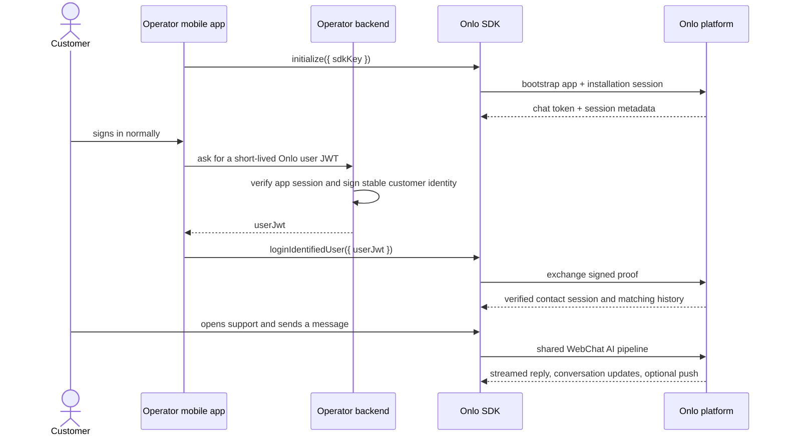

# Integrate Onlo in a mobile app

Use Onlo to add the same AI support experience already configured under **Web chat** to an Operator’s native mobile app. The app decides where customers open support; Onlo renders the messenger, answers with the shared AI pipeline, stores the conversation, and escalates when configured.

For account setup, local tools, manual testing, staging gates, and production readiness, use the [development and go-live guide](development-and-go-live-guide.md).

## What the app team needs

| Item | Provided by | Why it exists |
| --- | --- | --- |
| SDK API key | Onlo dashboard | Public install key that selects the Operator and one SDK family. It is safe to ship in the app, but can be rotated or retired by the Operator. |
| App identifier | App build configuration | iOS bundle ID or Android application ID, sent at session bootstrap. |
| Onlo user JWT | Operator backend | A short-lived signed proof of the app’s already-authenticated customer. It never belongs in the app binary. |
| Onlo mobile identity secret | Onlo dashboard + Operator backend | Server-only secret used to sign the user JWT. Never give it to the SDK. |

## How it works



The customer does **not** log in again to Onlo. The Operator’s app login remains the only customer login. Onlo accepts identity only after verifying the JWT signature created by the Operator backend.

## Install the SDK

No package is published yet. [`packages/react-native`](../packages/react-native) is reserved for the canonical `@onlo/react-native` thin facade and [`packages/flutter`](../packages/flutter) for `onlo_flutter`. Their native adapters are still pending, so neither is ready for production integration.

[`sdk/react-native`](../sdk/react-native) records the separately held prototype's migration boundary. Its legacy runtime is not part of the supported workspace, must not be merged into the new bridge, and must not be used by an app.

The public interface all platform wrappers must expose is:

```ts
Onlo.initialize({ sdkKey: 'onlo_rn_sk_…' });

// Call one of these after initialization.
Onlo.loginUnidentifiedUser();
Onlo.loginIdentifiedUser({ userJwt });

// The host app chooses its own support button, tab, or menu item.
Onlo.present();

// Call during the Operator app's own logout/account switch.
await Onlo.logout();
```

`initialize` does not display UI or prompt for notifications, camera, gallery, or microphone access. The release implementation restores protected local state, obtains a server session, and loads compatible Onlo configuration.

> Origin rule: production uses `https://onlo.ai`. A staging/review build receives its exact HTTPS origin from release configuration; the SDK never guesses or accepts a host-selected endpoint. Local development-only overrides must not ship.

## Anonymous customers

Call `loginUnidentifiedUser()` when the customer is not logged in to the Operator’s app, or when the Operator intentionally offers anonymous support.

Onlo still knows which Operator app owns the session from the SDK API key. The SDK keeps a protected installation identity so that anonymous history survives ordinary app restarts. The history is device-local; clearing app data or reinstalling starts a new anonymous identity.

## Identified customers

After the Operator app has authenticated a customer, its backend creates a fresh JWT and returns it to the app over the app’s normal authenticated API.

The backend signs only HS256 tokens with `aud` exactly `onlo-messenger`, a required opaque `sub` (1–255 characters, no control characters or leading/trailing whitespace), numeric `iat` and `exp`, and a lifetime of at most five minutes. Optional `name`, `email`, `phone`, `locale`, and bounded `customAttributes` follow the exact limits in the [API contract](api-contract.md). The SDK validates compact-token shape only and never treats decoded claims as verification; never mint the token in the app or ship its signing secret.

## Settings and updates

The v1 protocol defines bearer-authenticated `GET /api/sdk/v1/config` with schema `1`, `If-None-Match` when an ETag exists, and an empty `304` when unchanged. Native config implementations must apply `MobileConfig` v1 compatibility, security, appearance, features, content, and unsupported-widget settings; retain last-known-good config offline; and conditionally refresh on `config_changed`, foreground, and network recovery. `config_unavailable` follows `after_backoff`; `incompatible_client` is not retried.

The host app continues to control where `present()` is called. Browser-only settings are surfaced only through the documented compatibility/unsupported-setting projection.

## Notifications and images

The host app asks for notification permission only from a customer-triggered flow. The SDK registers the APNs or FCM token after permission is granted and removes its association on logout. Push is a wake-up hint: opening a notification always re-syncs the authorised conversation from Onlo.

The first release supports image attachments only: JPEG, PNG, or WebP, maximum 8 MiB each and three images per message. Camera and photo-library permissions are requested only after the customer selects the corresponding action. PDFs, text documents, audio, and arbitrary files are not advertised.

## Success criteria

- The app opens a native Onlo messenger from a host-owned button or screen.
- An anonymous customer can send and resume device-local conversations.
- A logged-in customer is verified without a second Onlo login and sees only that customer’s authorised history.
- Messages survive network loss in a durable outbox and are sent once when connectivity returns.
- Updated Onlo settings arrive safely without requiring an app release.

## Troubleshooting

| Symptom | Likely cause | What to do |
| --- | --- | --- |
| `sdk_not_available` during bootstrap | The server integration has not been released from internal availability. | Onlo must complete public release before external apps can connect. |
| Identity login is rejected | The backend minted a token the server does not accept. | Mint a fresh token from the Operator backend under the documented HS256 claim requirements; do not alter claims in the app. |
| Customer sees another account’s history | The host did not call `logout()` before an account switch. | Call and await `Onlo.logout()` as part of the app logout flow before logging in the next customer. |
| Settings appear stale | A conditional refresh has not yet converged. | Keep the last-known-good config and refresh with the documented ETag flow; never add a host-side endpoint. |
| A message appears stuck | The device is offline or the server has not acknowledged it yet. | Retain the same client message ID and let the SDK retry; do not send a duplicate from host code. |
