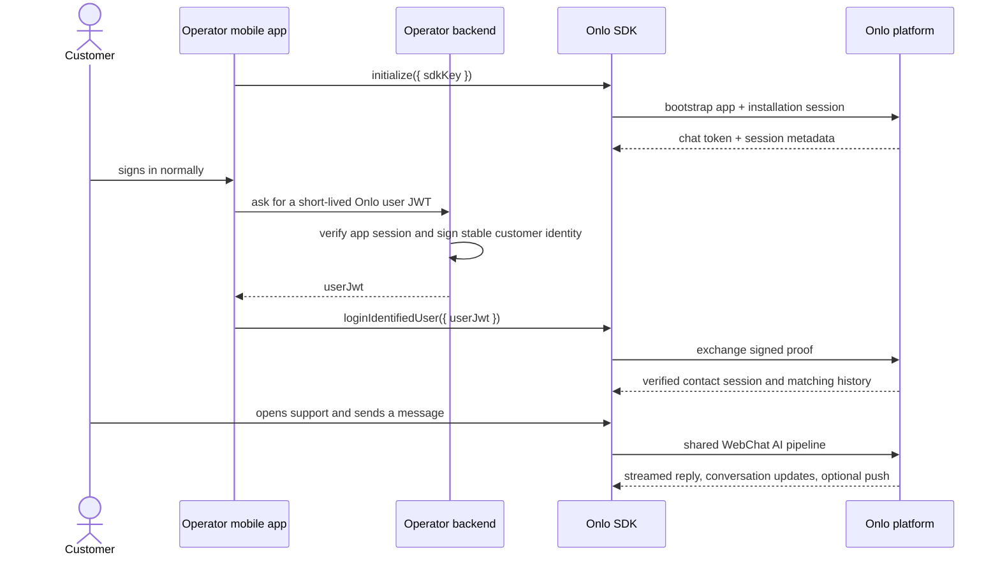

# Integrate Onlo in a mobile app

Use Onlo to add the same AI support experience already configured under **Web chat** to an Operator’s native mobile app. The app decides where customers open support; Onlo renders the messenger, answers with the shared AI pipeline, stores the conversation, and escalates when configured.

For account setup, local tools, manual testing, staging gates, and production readiness, use the [development and go-live guide](development-and-go-live-guide.md).

## What the app team needs

| Item | Provided by | Why it exists |
| --- | --- | --- |
| SDK API key | Onlo dashboard | Public install key that selects the Operator and one SDK family. It is safe to ship in the app, but can be rotated or retired by the Operator. |
| App identifier | App build configuration | iOS bundle ID or Android application ID, sent at session bootstrap. |
| Onlo user JWT | Operator backend | A short-lived signed proof of the app’s already-authenticated customer. It never belongs in the app binary. |
| Onlo mobile identity secret | Onlo dashboard + Operator backend | Server-only secret used to sign the user JWT. Never give it to the SDK. |

## How it works



The customer does **not** log in again to Onlo. The Operator’s app login remains the only customer login. Onlo accepts identity only after verifying the JWT signature created by the Operator backend.

## Install the SDK

No package is published yet. [`packages/react-native`](../packages/react-native) is the canonical `@onlo-ai/react-native` thin facade and [`packages/flutter`](../packages/flutter) is the `onlo_flutter` plugin. Their iOS and Android adapters are implemented against the native cores, but release artifacts and full host-build evidence are still required before production use.

[`sdk/react-native`](../sdk/react-native) records the separately held prototype's migration boundary. Its legacy runtime is not part of the supported workspace, must not be merged into the new bridge, and must not be used by an app.

The public interface all platform wrappers must expose is:

```ts
Onlo.initialize({ sdkKey: 'onlo_rn_sk_…' });

// Call one of these after initialization.
Onlo.loginUnidentifiedUser();
Onlo.loginIdentifiedUser({ userJwt });

// The host app chooses its own support button, tab, or menu item.
Onlo.present();

// Call during the Operator app's own logout/account switch.
await Onlo.logout();
```

`initialize` does not display UI or prompt for notifications, camera, gallery, or microphone access. The release implementation restores protected local state, obtains a server session, and loads compatible Onlo configuration.

> Origin rule: production uses `https://onlo.ai`. A staging/review build receives its exact HTTPS origin from release configuration; the SDK never guesses or accepts a host-selected endpoint. Local development-only overrides must not ship.

## Configure the host build

Published SDK packages do not load `.env` files. The host supplies the public SDK key to `initialize`; native code owns service-origin selection, credentials, durable data, and recovery.

| Value | Local development | Staging/review | Production |
| --- | --- | --- | --- |
| Public SDK key | Use a synthetic/test integration key through the host example configuration. | Inject the approved staging/review integration key through the app build. | Inject the production integration key through the app build. |
| Onlo service origin | A dedicated SDK-team harness may use an explicit HTTPS development seam. | Baked into the SDK release configuration; the host cannot select it. | Fixed to `https://onlo.ai`. |
| Operator backend origin | Owned by the host app’s existing environment configuration. | Host staging backend. | Host production backend. |
| User JWT | Fetched after host authentication and passed directly to native code. | Same. | Same. |
| Mobile identity signing secret | Operator backend secret store only. | Operator backend secret store only. | Operator backend secret store only. |

Use the platform’s normal build configuration:

1. On Android, add `ONLO_SDK_KEY` to the ignored `local.properties` for the repository example, using [`local.properties.example`](../examples/android/local.properties.example) as the shape.

   Expected result: Gradle generates only the public key into the example’s `BuildConfig`.

2. In React Native, set the public key in the host’s build-generated equivalent of [`onlo.config.ts`](../examples/react-native/onlo.config.ts).

   Expected result: JavaScript can call `initialize`, but it contains no signing secret, JWT, token, transcript, or endpoint override.

3. In Flutter, pass the public key with `--dart-define` or the ignored `onlo.local.json` shape shown in [`onlo.example.json`](../examples/flutter/config/onlo.example.json).

   Expected result: `String.fromEnvironment('ONLO_SDK_KEY')` receives public app configuration at compile time.

4. Keep npm, Maven, CocoaPods, and pub.dev credentials in the release CI secret store when publication is later approved.

   Expected result: no package-publishing credential or signing material is committed or distributed inside an SDK.

## Anonymous customers

Call `loginUnidentifiedUser()` when the customer is not logged in to the Operator’s app, or when the Operator intentionally offers anonymous support.

Onlo still knows which Operator app owns the session from the SDK API key. The
SDK keeps a protected installation identity so anonymous history survives
ordinary app restarts.

Continuity after uninstall or device restore is not guaranteed across
platforms. Treat it as best effort within the protected credential lifetime,
not as durable customer identity.

## Identified customers

After the Operator app has authenticated a customer, its backend creates a fresh JWT and returns it to the app over the app’s normal authenticated API.

The backend signs only HS256 tokens with `aud` exactly `onlo-messenger`, a required opaque `sub` (1–255 characters, no control characters or leading/trailing whitespace), numeric `iat` and `exp`, and a lifetime of at most five minutes. Optional `name`, `email`, `phone`, `locale`, and bounded `customAttributes` follow the exact limits in the [API contract](api-contract.md). The SDK validates compact-token shape only and never treats decoded claims as verification; never mint the token in the app or ship its signing secret.

## Settings and updates

The v1 protocol defines bearer-authenticated `GET /api/sdk/v1/config` with schema `1`, `If-None-Match` when an ETag exists, and an empty `304` when unchanged. Native config implementations must apply `MobileConfig` v1 compatibility, security, appearance, features, content, and unsupported-widget settings; retain last-known-good config offline; and conditionally refresh on `config_changed`, foreground, and network recovery. `config_unavailable` follows `after_backoff`; `incompatible_client` is not retried.

The host app continues to control where `present()` is called. Browser-only settings are surfaced only through the documented compatibility/unsupported-setting projection.

FAQ content and voice reuse the existing WebChat Behaviour settings.
Answered FAQs and published Help Center articles render directly without AI. Native voice is
speech-to-text dictation plus opt-in reply TTS around that same text path; it
does not introduce a WebRTC session or a new server endpoint. See the
[iOS integration guide](../packages/ios/README.md#voice) for host permission
requirements.

## Notifications and images

The host app asks for notification permission only from a customer-triggered flow. The SDK registers the APNs or FCM token after permission is granted and removes its association on logout. Push is a wake-up hint: opening a notification always re-syncs the authorised conversation from Onlo.

The first release supports image attachments only: JPEG, PNG, or WebP, with up to five images per message. A customer may select a source image up to 25 MiB; the SDK preserves aspect ratio, never crops, and normalizes it to no more than 8 MiB, a 4096-pixel edge, and 16 megapixels before upload. Camera and photo-library permissions are requested only after the customer selects the corresponding action. PDFs, text documents, audio, and arbitrary files are not advertised.

## Migrate from WebChat

WebChat and the native SDK can run concurrently for the same Operator. Mobile
reuses the shared support configuration and AI pipeline, but has a separate
install target, identity proof, and protected native session.

### What carries over

| Existing WebChat capability | Mobile behavior |
| --- | --- |
| Bot identity, supported colors, logo, greeting, and dark theme | Projected into the bounded native appearance configuration |
| AI agent, instructions, knowledge sources, actions, ticketing, and escalation | Reused through the same server conversation pipeline |
| FAQ, voice, timestamps, notification sound, and image-upload behavior settings | Projected into native configuration where the SDK implements the capability |
| Existing contacts and authorized history | Reused only when the verified Mobile `sub` and the WebChat identity resolve to the same Onlo contact |

Browser-only placement, dimensions, launcher, URL targeting, auto-open,
pre-chat forms, and custom CSS do not carry over. The host app owns native
placement and already owns the authenticated customer profile.

### What changes

| WebChat | Mobile SDK |
| --- | --- |
| `<script>` with a Web embed token | Native package plus a separate public Mobile SDK key |
| `window.Onlo.identify(...)` with WebChat HMAC | Operator backend mints a short-lived Mobile JWT; app calls `loginIdentifiedUser(userJwt:)` |
| Allowed web domains | Exact iOS bundle ID or Android application ID, plus target attestation policy |
| Browser-local session state | Keychain/Keystore credentials and an encrypted native SQLite outbox |
| Browser placement and automatic triggers | Host-owned Support button, tab, or route calls `present()` |
| Foreground stream and optional browser sound | Foreground stream plus APNs/FCM for identified customers |

The WebChat HMAC secret and Mobile identity secret are intentionally different.
The backend may reuse its authenticated customer lookup, but it must mint the
Mobile JWT with the Mobile secret and documented claims.

### Migration steps

1. Generate a separate Mobile SDK target and key under **WebChat → Install → Install for Mobile**.

   Expected result: the native app receives a public key scoped to its SDK family without changing the live Web embed token.

2. Register the exact bundle/application ID and configure the target’s security policy.

   Expected result: the server can reject a key used by an unregistered app target.

3. Keep the WebChat HMAC flow for web and add Mobile JWT minting to the authenticated Operator backend.

   Expected result: the app receives a fresh HS256 JWT with `aud: onlo-messenger`, stable `sub`, numeric `iat`/`exp`, and a maximum five-minute lifetime; neither signing secret enters the app.

4. Choose the stable Mobile `sub` that resolves the intended existing contact and verify it with synthetic data.

   Expected result: Mobile retrieves only history authorized for that resolved contact; email matching alone is not treated as proof.

5. Integrate `initialize`, one login method, host-controlled `present`, and awaited `logout`.

   Expected result: the native messenger uses the shared AI pipeline and prevents old-account state from crossing an account switch.

6. Configure APNs/FCM and pass the device token only after host permission and identified login.

   Expected result: customer-visible replies can wake the native app without exposing message content in the payload.

7. Validate anonymous, identified, offline, notification-open, and account-switch flows with synthetic users.

   Expected result: the native path is proven before any WebView replacement is removed.

8. Remove an app-embedded WebView widget after native validation; leave the mobile website’s WebChat installation unchanged if it is still needed.

   Expected result: native apps use the SDK while browser visitors continue using WebChat independently.

## Success criteria

- The app opens a native Onlo messenger from a host-owned button or screen.
- An anonymous customer can send and resume device-local conversations.
- A logged-in customer is verified without a second Onlo login and sees only that customer’s authorised history.
- Messages survive network loss in a durable outbox and are sent once when connectivity returns.
- Updated Onlo settings arrive safely without requiring an app release.

## Troubleshooting

| Symptom | Likely cause | What to do |
| --- | --- | --- |
| Session cannot be established | The key is unknown/disabled, the app identifier does not match its target, the client is incompatible, or Mobile remains release-gated. | Record only the safe error code. Verify the platform-specific key and exact bundle/application ID in **WebChat → Install → Install for Mobile**. `sdk_not_available` requires an Onlo release-state change; `target_disabled` requires an active target. |
| `sdk_not_available` during bootstrap | The server integration has not been released from internal availability. | Onlo must complete public release before external apps can connect. |
| Identity login is rejected | The Operator backend JWT violates the Mobile identity contract or was minted with the wrong secret. | Mint a fresh HS256 JWT with `aud: onlo-messenger`, a stable non-empty `sub`, numeric `iat`/`exp`, and a lifetime no longer than five minutes. Use the dashboard Mobile identity verifier with synthetic data; never log or persist the JWT. |
| Push does not arrive | The provider credential, target environment, customer identity, permission, or device-token registration is incomplete. | Test on a physical device. Match APNs sandbox/production or the FCM project to the registered target, log in an identified customer, obtain host-app permission, then call `setAPNsPushToken`, Android `registerPushToken`, or the wrapper `setPushToken`. Logout intentionally unregisters the association. |
| First Support open is slow | Initialization, protected-state restoration, session exchange, configuration, and the first transcript fetch have not completed. | Initialize at app startup and complete the selected login flow after host authentication. Present Support only after the SDK is ready. There is no `preload()` API or guaranteed first-open latency; measure the safe operation timings before optimizing. |
| Customer sees another account’s history | The host did not call `logout()` before an account switch. | Call and await `Onlo.logout()` as part of the app logout flow before logging in the next customer. |
| Settings appear stale | A conditional refresh has not yet converged. | Keep the last-known-good config and refresh with the documented ETag flow; never add a host-side endpoint. |
| A message appears stuck | The device is offline or the server has not acknowledged it yet. | Retain the same client message ID and let the SDK retry; do not send a duplicate from host code. |

## Frequently asked questions

| Question | Answer |
| --- | --- |
| Does the SDK work offline? | Yes. The encrypted native outbox retains queued messages and reuses the same `clientMessageId` when connectivity returns. Previously authorized cached content may remain readable; identity exchange, new history, media upload, and server acknowledgement still require a network. |
| How much does the SDK add to the app binary? | No fixed size is promised before release packaging is finalized. Measure the archived app with and without the exact SDK release and architecture set used by the host app. |
| Can staging and production use the same key? | Use separate Mobile targets and keys, normally with separate bundle/application IDs. This keeps test installations and conversations out of production and allows independent revocation and rollout. |
| What happens after uninstall and reinstall? | Anonymous continuity is best effort and may reset. An identified customer who logs in with a fresh valid JWT for the same stable `sub` can retrieve only the history the server authorizes for that resolved contact. |
| Can WebChat and Mobile represent the same customer? | Yes, when both verified identity flows resolve to the same Onlo contact. Matching an unverified email or arbitrary client-side user ID is not itself a unification guarantee. |
| Does the SDK support multiple languages? | The shared AI can answer according to the Operator’s agent configuration and conversation context. The current native SDK-owned controls are English; full SDK UI localization is not yet claimed. |
| What are the minimum platform versions? | iOS 15 or later and Android API 24 or later. No active-device coverage percentage is claimed. |
