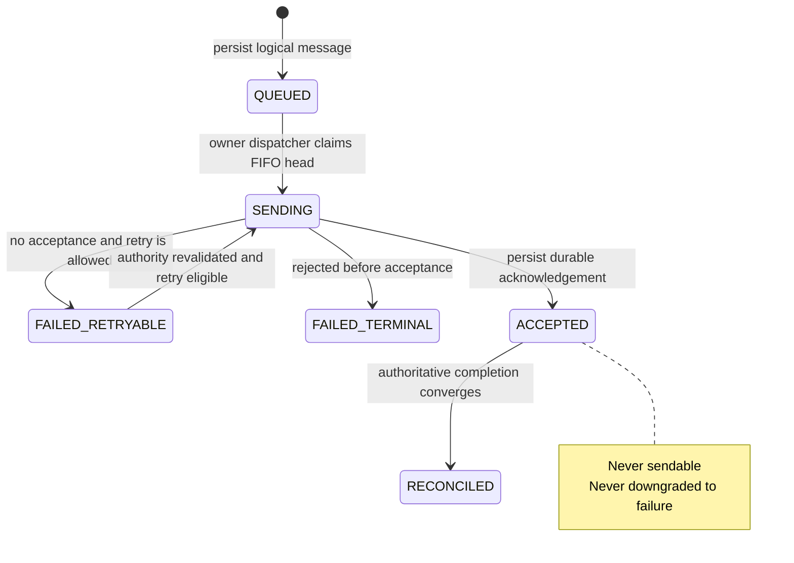

# Mobile SDK architectural invariants

These invariants are the architectural contract for every native core, bridge,
example, and future SDK change. A change that violates one is incorrect even if
its local tests pass.

Normative terms such as **must**, **never**, and **only** are deliberate. The
[API contract](api-contract.md) owns wire shapes; this document owns the client
properties that must remain true across implementations.

## Scope and terms

| Term | Meaning |
| --- | --- |
| Owner | The single anonymous-generation or server-verified identified scope authorised in one native runtime. |
| Runtime | One active native SDK instance and its current session authority. React Native and Flutter do not create separate runtimes. |
| Durable work | Owner-scoped outbox, transcript, read, push, and pending-transition state that must survive interruption. |
| Authority | The current owner, session generation, session identifier, and bearer context required to perform protected work. |
| `ACCEPTED` | Durable server acknowledgement that the logical message was received. It forbids another send attempt but does not prove transcript convergence. |
| `RECONCILED` | Terminal successful delivery state after the accepted turn has converged with the authoritative result. |

## Ownership boundaries

| Code owner | Responsibility | iOS | Android |
| --- | --- | --- | --- |
| Session and identity coordinator | Selects the one active owner and validates session authority across transitions. | [`OnloSDK`](../packages/ios/Sources/OnloSDK/OnloSDK.swift) | [`OnloClient`](../packages/android/src/main/kotlin/ai/onlo/sdk/OnloClient.kt) |
| Owner-scoped persistence | Enforces partition access and durable state transitions. | [`OwnerScopedPersisting` and `SQLiteOwnerScopedStore`](../packages/ios/Sources/OnloSDK/Storage.swift) | [`OwnerScopedOutboxStore`](../packages/android/src/main/kotlin/ai/onlo/sdk/storage/OutboxStore.kt) and [`SQLiteOutboxStore`](../packages/android/src/main/kotlin/ai/onlo/sdk/storage/SQLiteOutboxStore.kt) |
| Delivery dispatcher | Serialises sendable rows and preserves retry eligibility. | [`OnloSDK`](../packages/ios/Sources/OnloSDK/OnloSDK.swift) | [`DurableChatOutbox`](../packages/android/src/main/kotlin/ai/onlo/sdk/chat/ChatSync.kt) coordinated by [`OnloClient`](../packages/android/src/main/kotlin/ai/onlo/sdk/OnloClient.kt) |
| Accepted-row reconciler | Advances accepted rows without making them sendable again. | [`OnloSDK`](../packages/ios/Sources/OnloSDK/OnloSDK.swift) | [`OnloClient`](../packages/android/src/main/kotlin/ai/onlo/sdk/OnloClient.kt) with transcript convergence in [`ChatSync`](../packages/android/src/main/kotlin/ai/onlo/sdk/chat/ChatSync.kt) |
| Realtime hint adapters | Convert SSE and push input into authorised refetch or reconciliation work. | [`Transport`](../packages/ios/Sources/OnloSDK/Transport.swift) and [`OnloSDK`](../packages/ios/Sources/OnloSDK/OnloSDK.swift) | [`ChatSync`](../packages/android/src/main/kotlin/ai/onlo/sdk/chat/ChatSync.kt), [`OnloClient`](../packages/android/src/main/kotlin/ai/onlo/sdk/OnloClient.kt), and [`PushRegistry`](../packages/android/src/main/kotlin/ai/onlo/sdk/push/PushRegistry.kt) |

React Native and Flutter may expose these owners through typed bridges. They
must not introduce another session, owner, outbox, dispatcher, reconciler, or
transcript source of truth.

## Delivery state machine

`FAILED_TERMINAL` is terminal failure before acceptance. For an accepted
message, `RECONCILED` is the only terminal state.

## Identity invariants

| ID | Statement | Why it exists | What code owns it | Typical failure if violated |
| --- | --- | --- | --- | --- |
| ID-1 | One runtime must expose and transport work for exactly one owner at a time. | Concurrent owner authority can disclose history or send one customer's work as another customer. | Session and identity coordinator; owner-scoped persistence. | User A's transcript or pending message appears while User B is active. |
| ID-2 | Replacing one established host-app owner with another requires explicit logout. A server-confirmed anonymous-to-identified transition may bind the current runtime only while atomically retiring the anonymous scope. | The SDK cannot infer that a host account switch is safe. | Session and identity coordinator. | A repeated identified-login call silently replaces the current owner without revocation or cleanup. |
| ID-3 | Persistence reads, writes, retries, reconciliation, push handling, and transport must never cross owner scopes. | Correct UI partitioning alone does not prevent background leakage. | Session and identity coordinator; owner-scoped persistence; dispatcher; reconciler; realtime hint adapters. | Old-owner work is sent with the new owner's bearer or an old push opens protected content. |
| ID-4 | All durable identified and anonymous-generation state must be keyed and access-checked by owner scope. | Process death must not weaken the account boundary. | Owner-scoped persistence. | A global outbox, transcript, badge, cursor, or push record becomes visible after an account switch. |

## Delivery invariants

| ID | Statement | Why it exists | What code owns it | Typical failure if violated |
| --- | --- | --- | --- | --- |
| DL-1 | One logical message must retain one stable `clientMessageId` from durable enqueue through every permitted retry and reconciliation. | The server's idempotency boundary depends on stable identity. | Owner-scoped persistence; dispatcher. | A retry creates a duplicate customer turn. |
| DL-2 | Sendable rows must be dispatched in durable FIFO order within an owner scope. A retryable head may delay later rows; an unsendable terminal row must not strand them. | Customer intent and server turn ordering must remain deterministic. | Owner-scoped persistence; dispatcher. | Later text overtakes an earlier retry, or a terminal row deadlocks the queue. |
| DL-3 | A row must never be sent after `ACCEPTED` has been persisted. | Acceptance proves that another send can only duplicate the logical message. | Owner-scoped persistence; dispatcher. | Restart or cancellation replays an already accepted message. |
| DL-4 | Automatic send retry is permitted only before `ACCEPTED`, after the retry directive and current authority allow it. | Transport ambiguity before acceptance is recoverable; ambiguity after acceptance requires reconciliation. | Dispatcher; session and identity coordinator. | An accepted stream interruption is treated as a retryable send failure. |
| DL-5 | Every outgoing logical message must enter the durable owner-scoped outbox before chat transport begins. | App termination or enqueue-time cancellation must not lose customer work. | Owner-scoped persistence; dispatcher. | A message exists only in memory and disappears before or during the request. |

## Accepted-message invariants

| ID | Statement | Why it exists | What code owns it | Typical failure if violated |
| --- | --- | --- | --- | --- |
| AC-1 | `ACCEPTED` is a durable intermediate state, not terminal success. | Acceptance does not prove that the resulting transcript state was observed. | Owner-scoped persistence; accepted-row reconciler. | The SDK permanently stops tracking a message after the accepted frame. |
| AC-2 | `RECONCILED` is the terminal successful state for an accepted row. | Delivery needs one unambiguous completion boundary across live and restarted runtimes. | Owner-scoped persistence; accepted-row reconciler. | UI and recovery code disagree whether accepted work is complete. |
| AC-3 | The authorised transcript is the source of truth for recovery and convergence. Live completion may advance the current stream, but any ambiguity must resolve through transcript refetch. | Stream fragments and local projections can be incomplete or stale. | Accepted-row reconciler; realtime hint adapters; owner-scoped persistence. | A partial SSE response is treated as canonical history. |
| AC-4 | Accepted rows must remain durable and scheduled until they reconcile after restart, reconnect, foreground recovery, or a relevant live hint. | Accepted work can outlive the stream or session that created it. | Accepted-row reconciler; session and identity coordinator. | An accepted row remains stranded forever after process death or disconnect. |
| AC-5 | Accepted rows are never eligible for dispatch, retry, or downgrade to a failure state. | Reconciliation and resend are mutually exclusive recovery paths. | Owner-scoped persistence; dispatcher; accepted-row reconciler. | A reconciliation error changes `ACCEPTED` to retryable and duplicates the send. |

## Scheduler invariants

| ID | Statement | Why it exists | What code owns it | Typical failure if violated |
| --- | --- | --- | --- | --- |
| SC-1 | Whenever an owner has eligible send work and current authority, exactly one dispatcher must own that work; never more than one may exist for the owner. | Competing dispatchers break FIFO and can claim the same durable row. | Session and identity coordinator; dispatcher. | Concurrent sends overlap or a row is attempted twice. |
| SC-2 | Whenever an owner has accepted rows and current authority, exactly one accepted-row reconciler must own that work; never more than one may exist for the owner. | Competing reconcilers create duplicate polling, stale commits, and lost wakeups. | Session and identity coordinator; accepted-row reconciler. | Multiple loops race to update the same accepted row. |
| SC-3 | Scheduler ownership must be represented by explicit owner, authority, generation/token, and phase state. Liveness APIs such as `Job.isActive` or task cancellation state are not ownership. | Cancellation and completion are asynchronous and cannot prove who may mutate durable state. | Session and identity coordinator; dispatcher; accepted-row reconciler. | A replacement scheduler is suppressed by a cancelling job, or an old job commits after replacement. |
| SC-4 | Logout and session replacement must revoke old scheduler authority before safely starting replacement ownership; wakeups during transfer must not be lost. | Boundary races otherwise strand durable work or let stale work escape. | Session and identity coordinator; dispatcher; accepted-row reconciler. | A queued row remains `SENDING`, or an old-owner scheduler resumes after logout. |

## Session invariants

| ID | Statement | Why it exists | What code owns it | Typical failure if violated |
| --- | --- | --- | --- | --- |
| SS-1 | Same-owner session refresh must preserve all durable queued, retryable, accepted, and reconciliation work. | Bearer rotation changes authority, not ownership or logical work. | Session and identity coordinator; owner-scoped persistence. | Token refresh clears or abandons the outbox. |
| SS-2 | Session replacement must not lose work; it must recover interrupted pre-acceptance sends and resume accepted-row reconciliation under the replacement authority. | Process and network interruptions can occur at every session boundary. | Session and identity coordinator; dispatcher; accepted-row reconciler. | A replacement session leaves `SENDING` or `ACCEPTED` rows stranded. |
| SS-3 | Before retry, reconciliation, transcript commit, or realtime refetch, code must revalidate the current owner and session authority. | A captured bearer or session can become stale while asynchronous work is suspended. | Session and identity coordinator; dispatcher; accepted-row reconciler; realtime hint adapters. | A delayed task commits or transports under a revoked session. |

## Realtime invariants

| ID | Statement | Why it exists | What code owns it | Typical failure if violated |
| --- | --- | --- | --- | --- |
| RT-1 | Foreground SSE and push payloads are hints only; neither is protected content nor a transcript mutation. | Delivery can be duplicated, delayed, omitted, or arrive after an account boundary. | Realtime hint adapters. | A push payload or SSE event is rendered as authoritative content. |
| RT-2 | Every realtime-driven state change must converge through an authorised transcript or conversation refetch. | Refetch applies current server authority and ordering. | Realtime hint adapters; accepted-row reconciler. | Local unread, conversation, or message state diverges from the server. |
| RT-3 | Reconciliation must tolerate ordinary disconnects, missed hints, app suspension, and process restart without weakening owner checks or resending accepted work. | Realtime connectivity is not a correctness dependency. | Accepted-row reconciler; session and identity coordinator; realtime hint adapters. | A closed stream permanently stops convergence or triggers a duplicate send. |

## Push invariants

| ID | Statement | Why it exists | What code owns it | Typical failure if violated |
| --- | --- | --- | --- | --- |
| PU-1 | Push provider must match the native runtime: APNs on iOS and FCM on Android. React Native and Flutter must delegate to that native core instead of creating another token lifecycle. | A framework bridge cannot safely infer or translate provider credentials and owner state. | Host push adapter; framework bridge; native push registry. | An iOS FCM token is submitted as APNs, or JavaScript/Dart becomes a second source of truth. |
| PU-2 | The current token intent and every rotation must be registered only under current owner authority and retained in native protected storage until registration or explicit owner retirement reconciles. | Provider tokens rotate and transport can fail across process or network boundaries. | Session and identity coordinator; native push registry; protected token store. | A rotated token is lost, or a token is associated with the wrong customer. |
| PU-3 | Registration, unregistration, provider, permission, and notification-posting failures are push-only failures. They must not change session, identity, transcript, Messenger, or logout authority. | Optional notification delivery cannot become a prerequisite for customer support or account isolation. | Native push registry; host push adapter; bridge error mapping. | Chat stops because Firebase/APNs is unavailable, or logout is skipped after unregister fails. |
| PU-4 | An Onlo push contains identifiers only as a refetch hint. The SDK must validate its declared shape, re-authorize, and refetch before display or navigation. | Push delivery is unauthenticated, duplicable, delayed, and may cross an account transition. | Native push payload handler; transcript convergence; authorised navigation. | Stale or forged payload data opens content without current authority. |

## Conversation observation invariants

| ID | Statement | Why it exists | What code owns it | Typical failure if violated |
| --- | --- | --- | --- | --- |
| CO-1 | Within one current owner and authority, an older conversation-list observation must not replace a newer committed observation or a successful read acknowledgement. List commits use a monotonic request generation; server timestamps are not an ordering primitive. | Network responses can complete out of order without crossing an account or session boundary. | Conversation-list cache; unread publisher; read acknowledgement; realtime refetch adapter. | A delayed list response restores stale ordering, unread state, or an application badge. |
| CO-2 | Transcript transport, convergence, and commit for one owner and conversation must have one serialised writer. Different conversations and owner scopes remain independent. | Merging before a suspension does not protect a later full replacement from overwriting a newer transcript. | Transcript convergence coordinator; owner-scoped persistence. | A delayed full transcript response removes messages committed by a newer response. |
| CO-3 | Read acknowledgement never invents unread arithmetic locally. It invalidates older list observations and converges through a fresh authoritative conversation-list response. | The acknowledgement response cannot safely derive the aggregate unread count when other conversations or newer messages exist. | Read acknowledgement; conversation-list cache; unread publisher. | Mark-read decrements the badge incorrectly or a stale response permanently undoes the acknowledgement. |

## Persistence invariants

| ID | Statement | Why it exists | What code owns it | Typical failure if violated |
| --- | --- | --- | --- | --- |
| PS-1 | State that makes a network side effect recoverable must be durable before that side effect begins. This includes outbox enqueue and replayable session or push transitions. | A crash between side effect and persistence otherwise destroys the evidence required for safe recovery. | Owner-scoped persistence; session and identity coordinator; dispatcher. | A request succeeds remotely but restart cannot determine whether or how to resume. |
| PS-2 | Transient transport, server, decode, or authority-refresh failures must not destructively purge valid durable work. Purge is reserved for explicit owner retirement or proven unreadable/invalid protected state. | Temporary failure must not become customer data loss. | Owner-scoped persistence; session and identity coordinator. | Offline recovery deletes queued or accepted rows. |
| PS-3 | Every durable record and every persistence operation must remain owner scoped, including outbox, transcript, read state, cursor, push intent, and retry metadata. | Auxiliary records can leak identity or reactivate retired work just as easily as messages. | Owner-scoped persistence. | A global retry or push record crosses an account boundary. |

## Decision sources

| Source | Relationship to these invariants |
| --- | --- |
| [Mobile SDK architecture](architecture.md) | Defines system boundaries, lifecycle, and native ownership. |
| [Mobile SDK v1 API contract](api-contract.md) | Defines session, chat, acceptance, transcript, retry, and realtime wire semantics. |
| [Delivery plan](delivery-plan.md) | Defines native-core ownership and thin-bridge constraints. |

The repository currently has no accepted ADRs to cross-reference. A future ADR
may explain a decision behind an invariant, but it must not silently weaken or
supersede this contract; the invariant and its owning canonical documents must
be updated in the same reviewed change.
